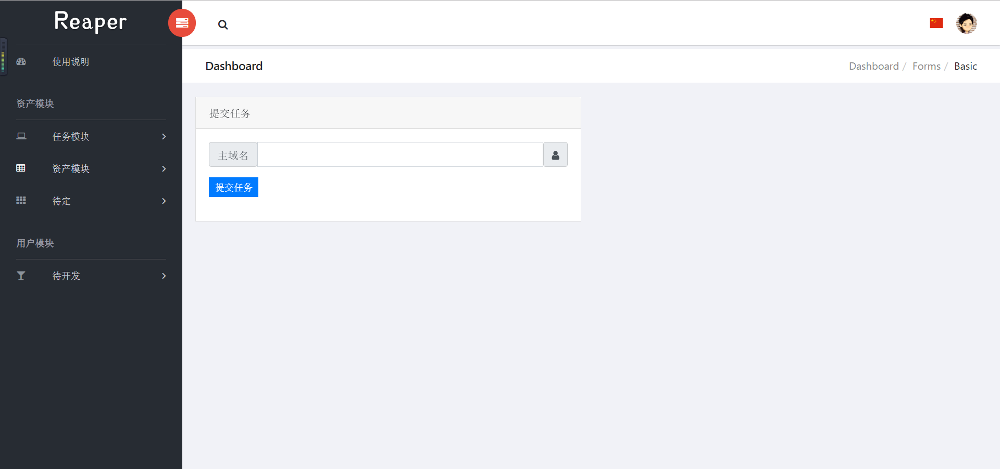
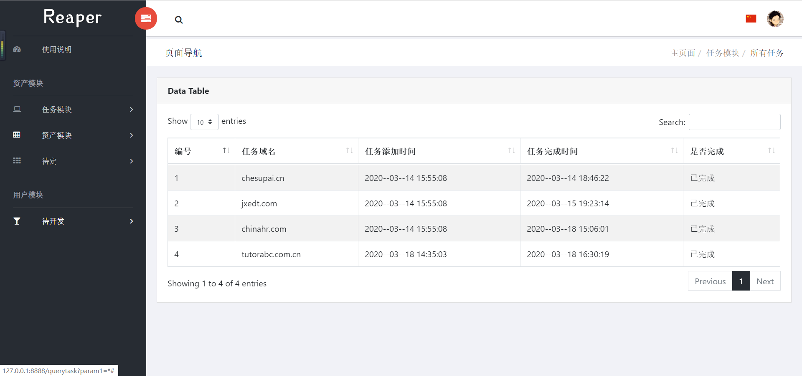
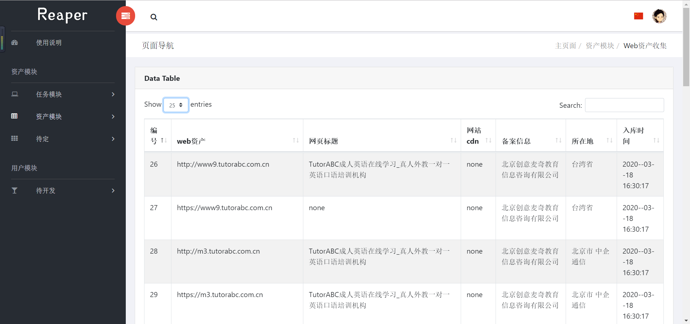

# Reaper

一款SRC资产信息收集的工具

[](https://www.apache.org/licenses/LICENSE-2.0)   
# 功能介绍

- 支持dns爆破子域名
- 支持众多第三方接口子域名查询接口，包括基于证书的子域名收集
- 支持cdn检测，基于cname与常见cdn段检测
- 支持备案信息查询
- 支持web界面显示

# 演示截图







# 使用方法

测试环境:
- windows
- python 3.7
- mysql8

环境安装：
1、python环境

```
# 可能没有标记完全，遇到缺少的库，自行pip一下
pip install -r requirement.txt
```
2、mysql8安装

> 参考链接：https://www.cnblogs.com/luoli-/p/9249769.html

3、config.ini配置

```ini
;reaper配置文件

[port];暂时废弃，无需配置
startnum = 21
stopnum = 65534
threadnum = 200


[dns]
dnsnum = 8000
subdict = sub_full.txt;dict目录下自行选择添加

[email];暂时废弃，无需配置
email = 1
code = 2
emailpower = False

[mysql]
host = 192.168.1.111;修改为mysql地址，web与mysql同一服务器则127.0.0.1
user = root
password = 123456
database = reaper
```
4、数据库建立

```bash
#新建reaper数据库，编码ut8-8

# 新建两个表
CREATE TABLE `reaper`.`subdomaintask`  (
  `id` int(0) NOT NULL AUTO_INCREMENT,
  `task` varchar(255) CHARACTER SET utf8 COLLATE utf8_general_ci NULL DEFAULT NULL,
  `intime` varchar(255) CHARACTER SET utf8 COLLATE utf8_general_ci NULL DEFAULT NULL,
  `flag` varchar(255) CHARACTER SET utf8 COLLATE utf8_general_ci NULL DEFAULT NULL,
  `outtime` varchar(255) CHARACTER SET utf8 COLLATE utf8_general_ci NULL DEFAULT NULL,
  PRIMARY KEY (`id`) USING BTREE
) ENGINE = InnoDB AUTO_INCREMENT = 6 CHARACTER SET = utf8 COLLATE = utf8_general_ci ROW_FORMAT = Dynamic;

CREATE TABLE `reaper`.`subdomain`  (
  `id` int(0) NOT NULL AUTO_INCREMENT,
  `subdomain` varchar(255) CHARACTER SET utf8 COLLATE utf8_general_ci NULL DEFAULT NULL,
  `title` varchar(255) CHARACTER SET utf8 COLLATE utf8_general_ci NULL DEFAULT NULL,
  `wtime` varchar(255) CHARACTER SET utf8 COLLATE utf8_general_ci NULL DEFAULT NULL,
  `cdn` varchar(255) CHARACTER SET utf8 COLLATE utf8_general_ci NULL DEFAULT NULL,
  `record` varchar(255) CHARACTER SET utf8 COLLATE utf8_general_ci NULL DEFAULT NULL,
  `ipwhere` varchar(255) CHARACTER SET utf8 COLLATE utf8_general_ci NULL DEFAULT NULL,
  `groupdomain` varchar(255) CHARACTER SET utf8 COLLATE utf8_general_ci NULL DEFAULT NULL,
  PRIMARY KEY (`id`) USING BTREE
) ENGINE = InnoDB AUTO_INCREMENT = 412 CHARACTER SET = utf8 COLLATE = utf8_general_ci ROW_FORMAT = Dynamic;
```

# 使用说明

web部分由于默认个人使用，没做登陆注册，之后补，，，

进入http://你的ip/，之后f12修改cookies，新增key 123456使用

增加任务在web界面完成，web启动命令

```bash
cd ./server/reaper/

python manage.py runserver 0:8888  #8888为端口，自定义即可
```

任务增加之后，另开一个命令窗口，回到根目录下
```bash
python start.py #一直等到执行完吧
```

linux推荐screen后台执行


# 吐槽与后续

此项目1.0版本已废弃，现版本2.0，逐渐完善中，后续添加：

- 端口扫描处理
- 增加crawlergo爬虫
- 增加被动扫描结果的入库
- 增加与awvs的互动
- 增加xray poc的结合处理
- ......再说吧，上面这些够弄了

感谢1.0版本中一起开发的三位小伙伴

@安逸猪 @打代码要优雅 @我不会翻转二叉树

感谢@b0ring师傅在2.0版本开发中的思路交流