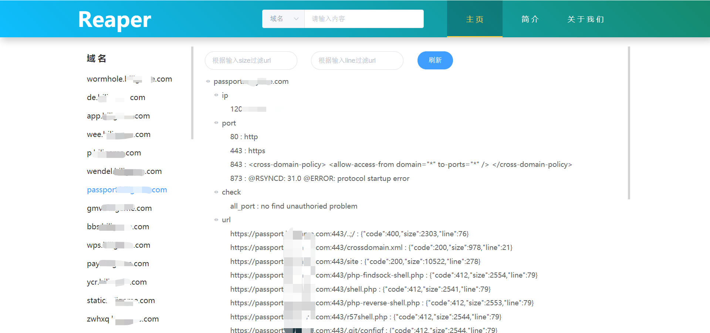

# Reaper

一款用于收集渗透测试信息的工具，支持：子域名扫描，端口扫描，目录扫描，未授权验证，cors检测，更多持续开发

# 功能介绍

- 支持子域名爆破与爬虫双模式
- 支持常见未授权端口验证
- 支持web服务目录敏感fuzz
- 支持cors检测
- 支持字典自定义
- 支持页面展示结果
- 支持页面二次筛选资产
- 对子域名泛解析进行过滤
- 对端口伪web banner进行过滤
- 对目录采取启发式扫描，过滤假性404
- 采用协程，线程池，多进程全面提速


# 使用方法

测试环境:
- ubuntu/windows
- python 3.6/3.7/3.8

环境安装：
```
pip install -r requirement.txt
```

查看参数帮助：
```
python start.py -h
```

推荐用法：
```
# 启动本地java web服务，双击./view/start.bat

# 启动资产收集
python start.py -u test.com  -p 21-20000 -d1 subnames_full.txt -d2 dicc.txt -cd 100 -x 403,402,401,302,301 --engine --cors

# 进入./view/view/index.html，查看资产收集页面
```
最终页面效果图：




# 吐槽与后续

此项目为参加19年上海市网络安全大赛作品赛作品，很遗憾并未取得很好的成绩（小声bb，拿论文直接改个软件还是好拿奖啊，反正评委看不懂）

后续想法：
- 端口扫描自己写确实很难，也没找到什么好的技术方案，准备改调用masscan
- 这种长时间的资产收集，还是得写个后端，配合数据库
- 完善漏洞验证poc自定义添加
- 封装docker
- ........

上述想法实际还得花费很久的时间，如果有兴趣参与开发的，可以issues与我联系，如有使用bug也欢迎提出~

最后感谢我的团队三个成员：

@安逸猪

@打代码要优雅

@我不会翻转二叉树