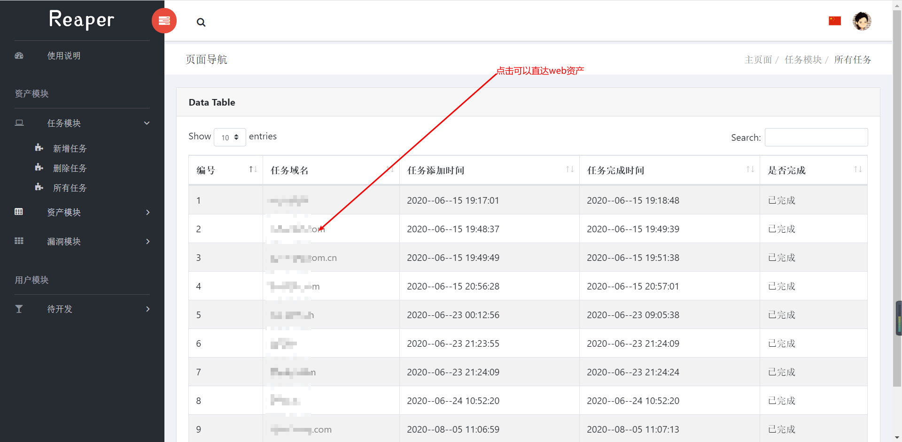
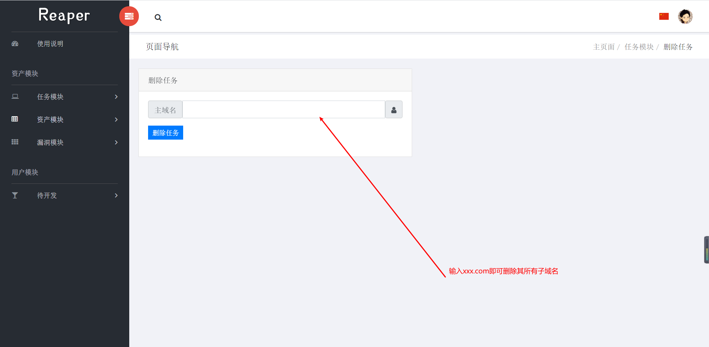
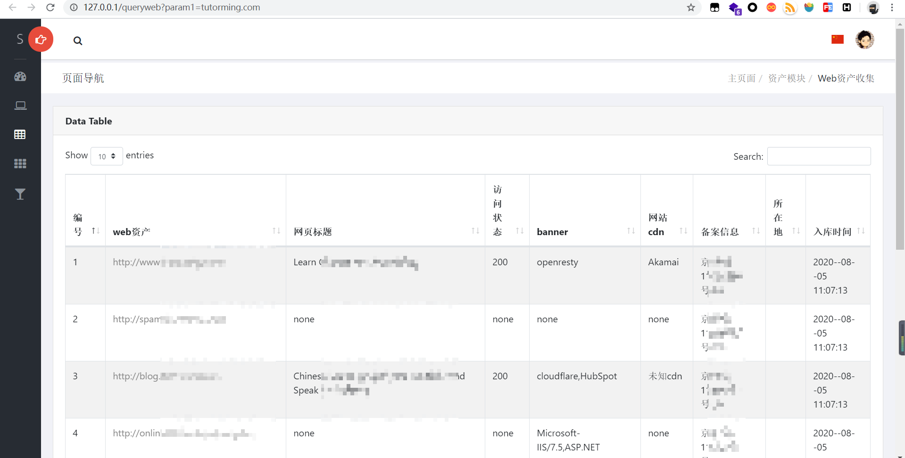
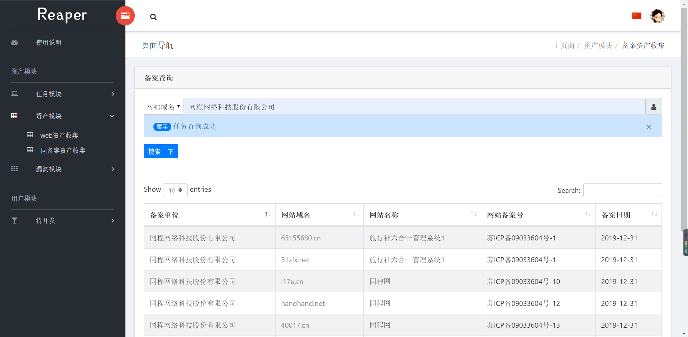
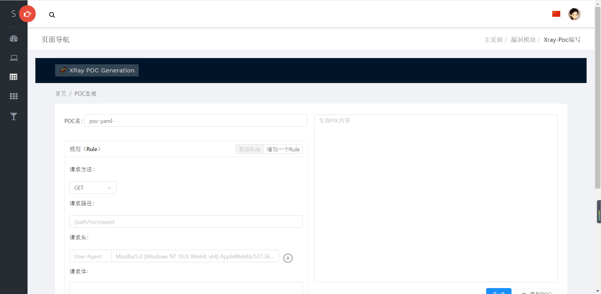

# Reaper

一款SRC资产信息收集的工具，你身边的资产收割利器~

[](https://www.apache.org/licenses/LICENSE-2.0)   
# 功能介绍

- 支持基于oneforall收集资产的导入
- 对oneforall导入资产进行二次梳理，优化显示
- 支持cdn检测，基于cname与常见cdn段检测
- 支持域名备案/同备案站点信息查询
- 支持清理awvs
- 支持清理数据之后快速提交给awvs扫描
- 支持xray-poc编写，集成工具来源[xray-poc-generation](https://github.com/phith0n/xray-poc-generation)

# 演示截图

1. 任务模块

   

2. 删除任务模块

   

3. 资产模块

   

4. 同备案查询

   

5. xray-poc编写模块

   

# 快速配置

测试环境:
- windows
- python 3.7
- mysql8

环境安装：
1、python环境

```
# 可能没有标记完全，遇到缺少的库，自行pip一下
# 欢迎反馈一下缺少哪些库
pip install -r requirement.txt
```
2、mysql8安装

> 参考链接：https://www.cnblogs.com/luoli-/p/9249769.html

3、config.ini配置

```ini
;reaper配置文件

[email];只支持qq邮箱
email = 1
code = 2
emailpower = False

[mysql];密码不一致的话，注意修改reaper/reaper/settings.py中的DATABASES配置
host = 127.0.0.1
user = root
password = 123456
database = reaper

[awvs]
token = xxx
website = https://awvs
```
4、数据库建立使用说明

```
新建数据库reaper编码utf-8之后，使用reaper.sql文件快速建立各个表
```

# 快速使用

1. web端

   ```cmd
   cd reaper
   python manage.py runserver 0:80
   
   # 访问 127.0.0.1显示未授权，手动赋予 key 123456    cookie对即可使用
   ```

2. tools端

   ```cmd
   cd reaper_tools
   # 查看帮助
   python start.py -h
   
   # 注意事项，使用oneforall命令如下：
   python oneforall.py --target xxx.com --format json run
   
   # 之后将xxx.com.json文件挪到/reasult 路径下即可导入
   # awvs限制了最多同时并发三个扫描，充分利用学生云主机性能
```
   
   


# 吐槽与后续

此项目历经两次大改，现版本2.0

~~逐渐完善中，后续添加功能~~

目前应该暂时不会添加什么功能了，我的感觉是，有些没必要集成的功能，集成了反而是负担


感谢1.0版本中一起开发的三位小伙伴

@安逸猪 @打代码要优雅 @我不会翻转二叉树

感谢@b0ring师傅在2.0版本开发中的思路交流